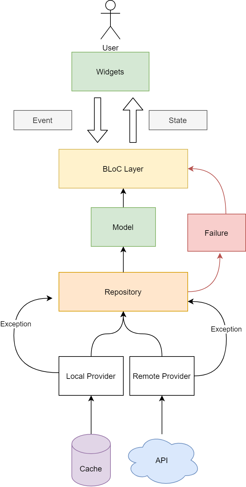

# 

> ### Flutter codebase containing real world examples (CRUD, auth, advanced patterns, etc) that adheres to the [RealWorld](https://github.com/gothinkster/realworld) spec and API.

### [Demo]()&nbsp;&nbsp;&nbsp;&nbsp;[RealWorld](https://github.com/gothinkster/realworld)

This codebase was created to demonstrate a fully fledged fullstack application built with **Flutter** including CRUD operations, authentication, routing, pagination, and more.

We've gone to great lengths to adhere to the **Flutter** community styleguides & best practices.

For more information on how to this works with other frontends/backends, head over to the [RealWorld](https://github.com/gothinkster/realworld) repo.

# How it works

> In general we are following BLoC architecture to make this app.
>
> This image shows the architecture of this. Big shoutout to @reso-dev for his youtube tutorials [link](https://www.youtube.com/c/ResoCoder) which is the place I have gotten the inspiration.
>

# Getting started

> To get started with this project....

